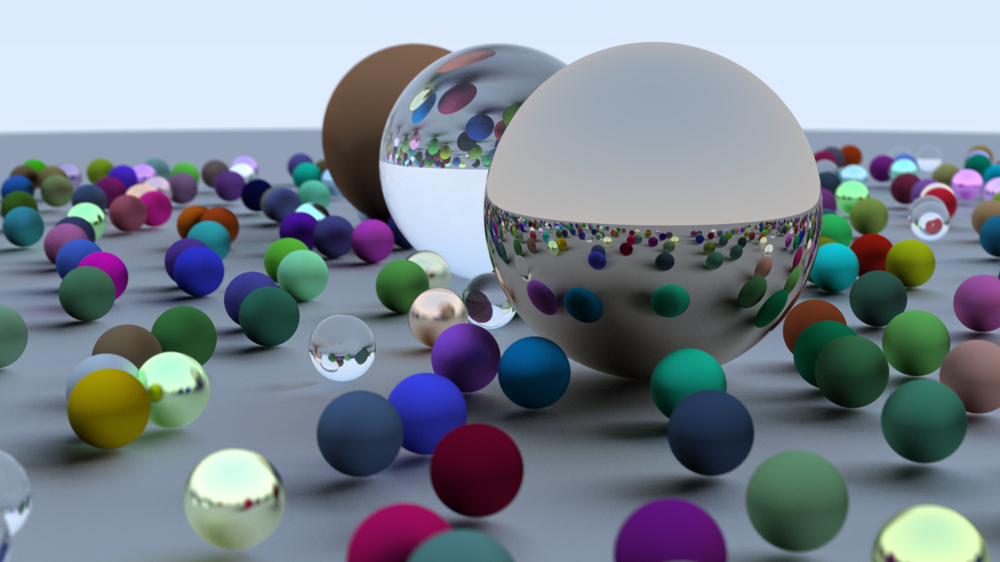

# Ray Tracer

A physically-based ray tracer written in C++, built by following Peter Shirley's [_Ray Tracing in One Weekend_](https://raytracing.github.io/books/RayTracingInOneWeekend.html).



---

## Features

- **Materials** — Lambertian diffuse, metal with configurable fuzz, and dielectric (glass) with Snell's law refraction
- **Hollow glass** — implemented via a negative-radius inner sphere to simulate an air bubble
- **Antialiasing** — stratified multisampling (100 samples/pixel)
- **Gamma correction** — gamma-2 encoding for perceptually correct output
- **Defocus blur** — thin-lens approximation with configurable aperture and focal distance
- **Positionable camera** — arbitrary `lookfrom`/`lookat` with vertical FOV control

## Project structure

```
├── src/
│   └── raytracer.cpp       # Main render loop and scene setup
├── include/
│   ├── camera.h            # Camera, ray generation, defocus disk
│   ├── material.h          # Lambertian, metal, dielectric
│   ├── sphere.h            # Sphere primitive
│   ├── hittable.h          # Abstract hittable interface
│   ├── hittable_list.h     # Scene container
│   ├── vec3.h              # Vector math + random sampling utilities
│   ├── ray.h               # Ray type
│   ├── colour.h            # Colour output + gamma correction
│   ├── interval.h          # Scalar interval utility
│   └── rtweekend.h         # Constants and common includes
└── CMakeLists.txt
```

## Build and run

Requires CMake ≥ 3.10 and a C++17 compiler.

```bash
cmake -B build
cmake --build build
./build/raytracer > image.ppm
```

Convert to PNG with ImageMagick:

```bash
convert image.ppm raytracing.png
```

## Notes

- The Lambertian scatter uses a true unit-sphere distribution (`random_unit_vector`) rather than the hemispherical approximation, matching the correct cosine-weighted PDF.
- The defocus blur is a thin-lens approximation: rays are jittered across a disk at the camera origin whose radius is derived from `focus_dist * tan(defocus_angle / 2)`.
- Shadow terminator artefacts are avoided by offsetting the ray interval minimum to `t = 0.001`.